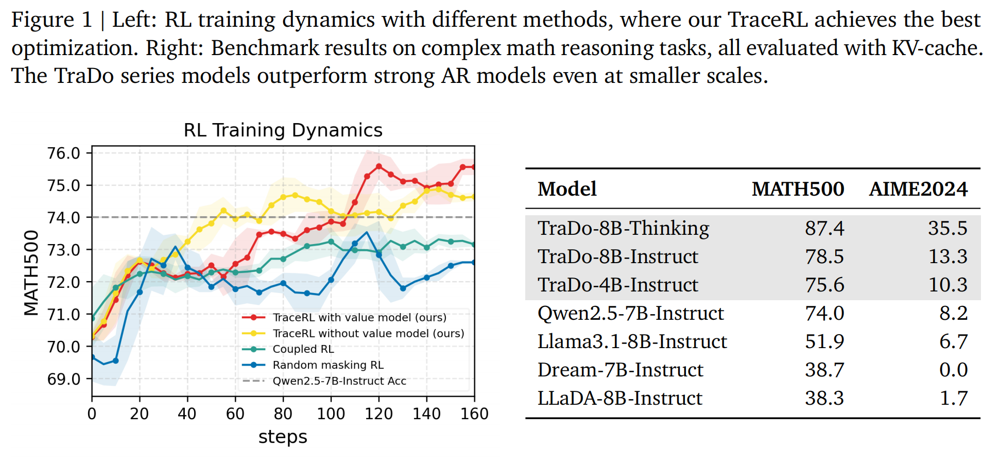
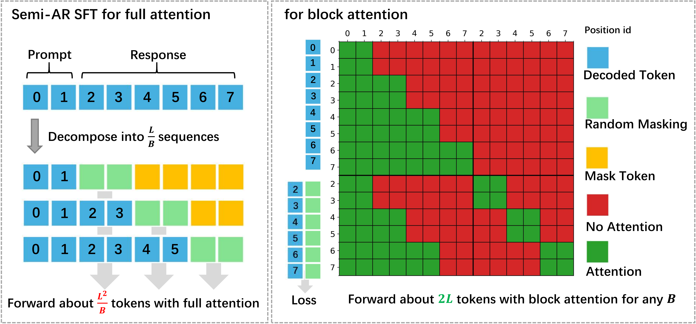
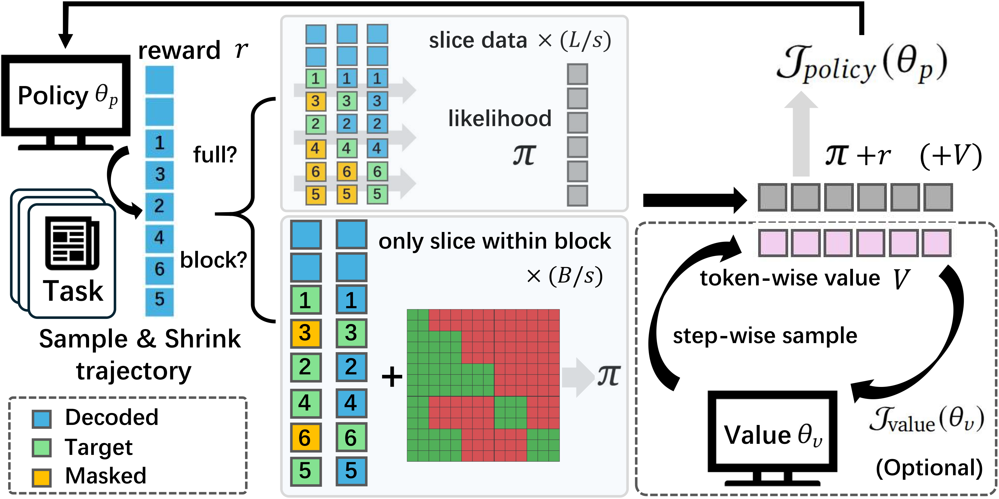

<div align="center">
<br>

<h3>Comprehensive Framework for Deploying and Training Diffusion Language Models</h3></div>


<p align="center">
  <a href="https://arxiv.org/abs/2506.03136">
    
  <a href="https://huggingface.co/collections/Gen-Verse/reasonflux-coder-6833109ed9300c62deb32c6b">
    
  </a>
  <a href="https://huggingface.co/collections/Gen-Verse/reasonflux-coder-6833109ed9300c62deb32c6b">
    
  </a>
</p>


<p align="center">
  
</p>


## 🌱 Features 

- Model Support: TraDo, [SDAR](https://github.com/JetAstra/SDAR), [Dream](https://github.com/DreamLM/Dream), [LLaDA](https://github.com/ML-GSAI/LLaDA), [MMaDA](https://github.com/Gen-Verse/MMaDA), [Diffu-Coder](https://github.com/apple/ml-diffucoder) We support models with diverse structures, including full attention models, adapted models, and block attention models.
- Inference: improved [KV-cache](https://github.com/NVlabs/Fast-dLLM/tree/main), [jetengine](https://github.com/Labman42/JetEngine/tree/0ddc55ad3fb712b6374515b78d656f420e1a7243) (based on nano-vllm), different sampling strategies, support multi-nodes, easy to build your own accelerated inference methods
- RL: TraceRL (support diffusion value model), [coupled RL](https://github.com/apple/ml-diffucoder), [random masking RL](https://github.com/Gen-Verse/MMaDA), accelerated sampling, including Math, coding, and general RL tasks, support multi-nodes, easy to build your reinforcement learning methods across diverse settings
- SFT: Flash block SFT, semi-AR SFT, random masking SFT, support multi-nodes and long-CoT finetune


## 🧠 Methods & Models

We propose TraceRL, a trajectory-aware reinforcement learning method for diffusion language models, which demonstrates the best performance among RL approaches for DLMs. We also introduce a diffusion-based value model that reduces variance and improves stability during optimization.


<p align="center">
  
  
</p>

Based on TraceRL, we derive a series of diffusion language models, TraDo, which achieve state-of-the-art performance on math and coding reasoning tasks. TraDo-4B-Instruct and TraDo-8B-Instruct are trained solely with TraceRL, while the first long-CoT diffusion language model, TraDo-8B-Thinking, is obtained through a combination of TraceRL and long-CoT data SFT. TraDo models challenge AR models with strong empirical results, as shown in the following table.

<p align="center">
  
</p>

## 📰 Latest Updates
* **[2025-09-08]** 🔥  We release our models, [TraDo-4B-Instruct](https://huggingface.co/Gen-Verse/ReasonFlux-Coder-7B) and [TraDo-8B-Instruct](https://huggingface.co/Gen-Verse/ReasonFlux-Coder-14B), and the first long-CoT diffusion language model [TraDo-8B-Thinking](https://huggingface.co/Gen-Verse/ReasonFlux-Coder-7B).
* **[2025-09-08]** 🔥  We release inference and training code compatible with a wide range of diffusion language models.


## 🚀 Quick Start


```bash
conda create --name dllm-rl python=3.10
source activate dllm-rl
pip install torch==2.6.0
pip install --no-cache-dir \
  https://github.com/Dao-AILab/flash-attention/releases/download/v2.7.4.post1/\
flash_attn-2.7.4.post1+cu12torch2.6cxx11abiFALSE-cp310-cp310-linux_x86_64.whl
pip install -r requirements.txt
```


## ⚙️ Data

You can navigate to `./data` to download datasets for evaluation and training, for example as follows. In that directory, you will also find detailed instructions on how to modify your own dataset.
```bash
cd data
python download_data.py --dataset MATH500
python download_data.py --dataset MATH_train
cd ..
```


## 📊 Inference & Evaluations

After downloading the data, take TraDo and SADR models as an example. You can set the configurations in `configs/sdar_eval.yaml` and run the following commands to perform inference with different sampling strategies.
```bash
python eval.py config=configs/sdar_eval.yaml
```
Use `sdar_eval.yaml` for TraDo and SDAR models' inference, `dream_eval.yaml` for Dream and Diffu-Coder, and `llada_eval.yaml` for LLaDA and MMaDA. Instructions on how to set the configurations are provided in the corresponding configuration files.  
We support both general tasks and coding tasks (including automated execution of code) in evaluation.  
You can also perform inference across multiple nodes using `multinode_eval.py` with the same configuration files, with only minor modifications as instructed in the configuration files.
In multi-node setup, the first node controls the others. You can simply run  
`python multinode_eval.py config=configs/sdar_eval.yaml` on the first node, or submit the following as the entry command for a job:

```bash
if [[ ${MLP_ROLE_INDEX:-0} -eq 0 ]]; then   
    python multinode_eval.py config=configs/sdar_eval.yaml
else
    exec tail -f /dev/null
fi
```


## 🔧 Reinforcement Learning

After downloading the data and model and setting the configuration, you can start reinforcement learning simply with:
```bash
python rl.py config=configs/rl_sdar.yaml
```

We support TraceRL (optionally with a diffusion-based value model), Coupled RL, and random masking RL across different diffusion language models. The sampling process has been accelerated in all cases by KV-cache.

We also support a multi-node RL framework; you can submit the following as the entry command:
```bash
if [[ ${MLP_ROLE_INDEX:-0} -eq 0 ]]; then   
    python multinode_rl.py config=configs/multinode_rl_dream.yaml
else
    exec tail -f /dev/null
fi
```

## 🔧 Supervised Finetuning

```bash
accelerate launch \
  --num_machines 1 \
  --machine_rank 0 \
  --main_process_ip 127.0.0.1 \
  --main_process_port 8888 \
  --config_file accelerate_configs/1_node_8_gpus_deepspeed_zero3.yaml \
  train/sft_sdar.py \
  config=configs/sft_sdar.yaml
```


```bash
accelerate launch \
  --num_machines $MLP_WORKER_NUM \
  --machine_rank $MLP_ROLE_INDEX \
  --main_process_ip $MLP_WORKER_0_HOST \
  --main_process_port $MLP_WORKER_0_PORT \
  --config_file accelerate_configs/2_node_8_gpus_deepspeed_zero3.yaml \
  train/sft_sdar.py \
  config=configs/sft_sdar.yaml
```

## 📖 Citation

## 🤝 Acknowledgement


## 💬 Discussion

Please do not hesitate to report any issues or difficulties you encounter.


